<a name="readme-top"></a>


# Library-Management-System


> Welcome aboard fellow developer, this is where you will find projects which you are free to contribute to. You can contribute by submitting your own scripts, which you think would be amazing for other people to see.

## Description

Desktop application built with ***JavaFX*** and ***MySQL*** designed to manage all the functions of a library. It helps the librarian to maintain the database of new books and borrowed books along with their due dates. It tracks the records of the number of books in the library, how many books are issued, how many books have been returned or renewed.

## Installation

Download the project from github to your desktop:

  - **With Git** :
      If you’re familiar with git and have it installed on your computer, you can clone the repository to download the files.
      
      **1.** Click the green button labeled &nbsp;`Code`</br>
      
      &nbsp;&nbsp;&nbsp;&nbsp;&nbsp;&nbsp;&nbsp;&nbsp;&nbsp;&nbsp;&nbsp;&nbsp;&nbsp;&nbsp;&nbsp;&nbsp;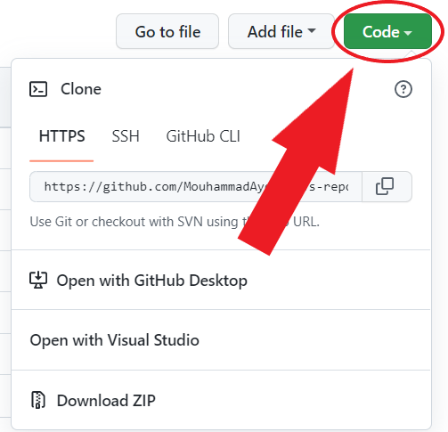</br>
      
      **2.** Copy the URL of the repository</br>
      
      **3.** Next, on your local machine, open your bash shell and change your current working directory to the location where you would like to clone your repository
      ```shell
      cd "path-to-your-folder"
      ```
      
      **4.** Once you have navigated to the directory where you want to put your repository, you can use
      ```shell
      git clone https://github.com/alaaballoutdev/Library-Management-System.git
      ```
      
      **5.** When you run `git clone https://github.com/alaaaballoutdev/Library-Management-System.git`, You should see output like
      ```shell
      Cloning into 'test-repo'...
      remote: Counting objects: 5, done.
      remote: Compressing objects: 100% (4/4), done.
      remote: Total 5 (delta 0), reused 0 (delta 0), pack-reused 0
      Unpacking objects: 100% (5/5), done.
      Checking connectivity... done.
      ```
      </br>
      
  - **Without Git** :
      When downloading materials to your laptop, it is easiest to download the entire repository.
      
      **1.** Click on the green `Code` button, then download the repository as a ZIP file</br>
      
      &nbsp;&nbsp;&nbsp;&nbsp;&nbsp;&nbsp;&nbsp;&nbsp;&nbsp;&nbsp;&nbsp;&nbsp;&nbsp;&nbsp;&nbsp;&nbsp;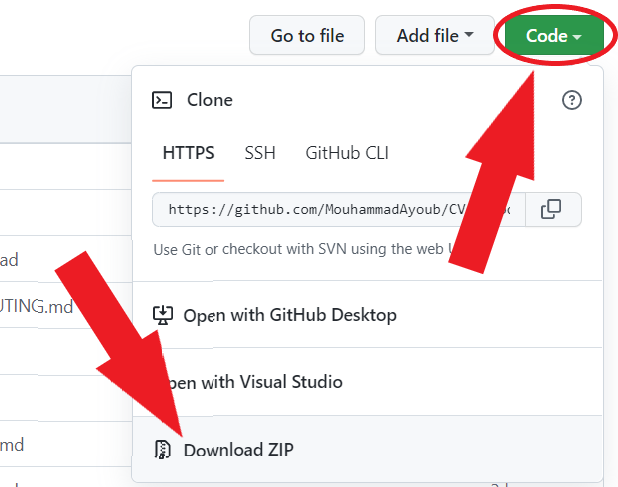</br>
      
      **2.** Find the downloaded .zip file on your computer, likely in your Downloads folder</br>
      
      **3.** Unzip it, this will create a folder named after the GitHub repository</br></br>

  - **Steps you must do to make the app work properly** :
      
      **1.** Launch ***MySQL Workbench*** and create a database named `librarydb`</br>
      
      **2.** Run the content of `library.sql` file in the database you just created in order to create all the database tables</br>
      
      **3.** Change the ***url***, ***user*** and ***password*** of database connection in the `Database.java` file</br>
      
      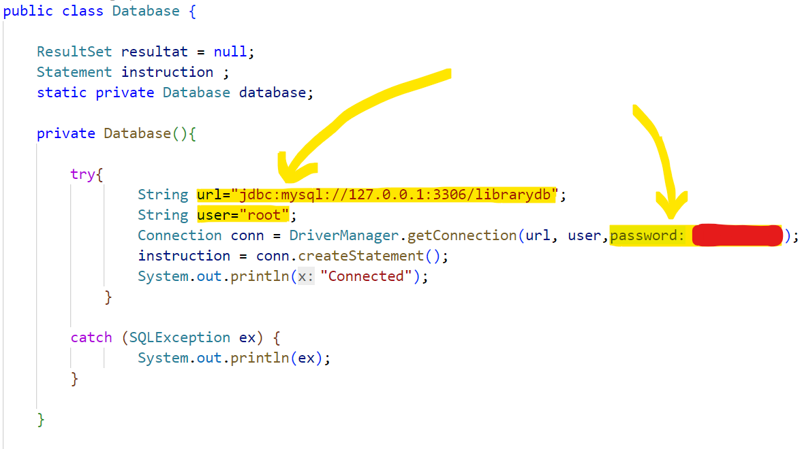</br>

<p align="right">(<a href="#readme-top">back to top</a>)</p>

## Usage

- ***Welcome Page :*** &nbsp;This is the `First Page` that appears when you enter the website 👇

</br>

***Note :*** &nbsp;If you choose to login as an admin, you will be redirected to the `Admin Login Page`

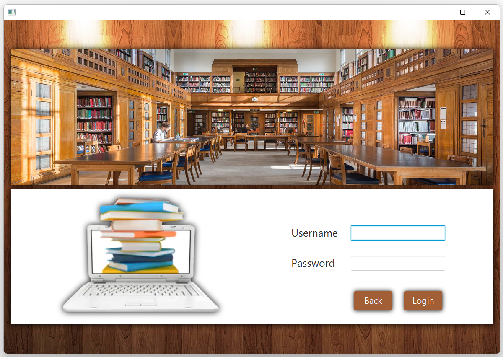</br>

***Note :*** &nbsp;If you choose to login as a member, you will be redirected to the `Member Login Page`

</br>

***Note :*** &nbsp;If you type a username that does not exist in the database, an `Validation Message` will appear

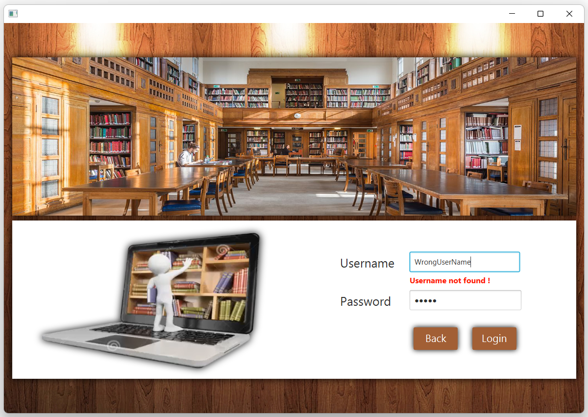</br>

***Note :*** &nbsp;Same thing about validation for the `Password Field`

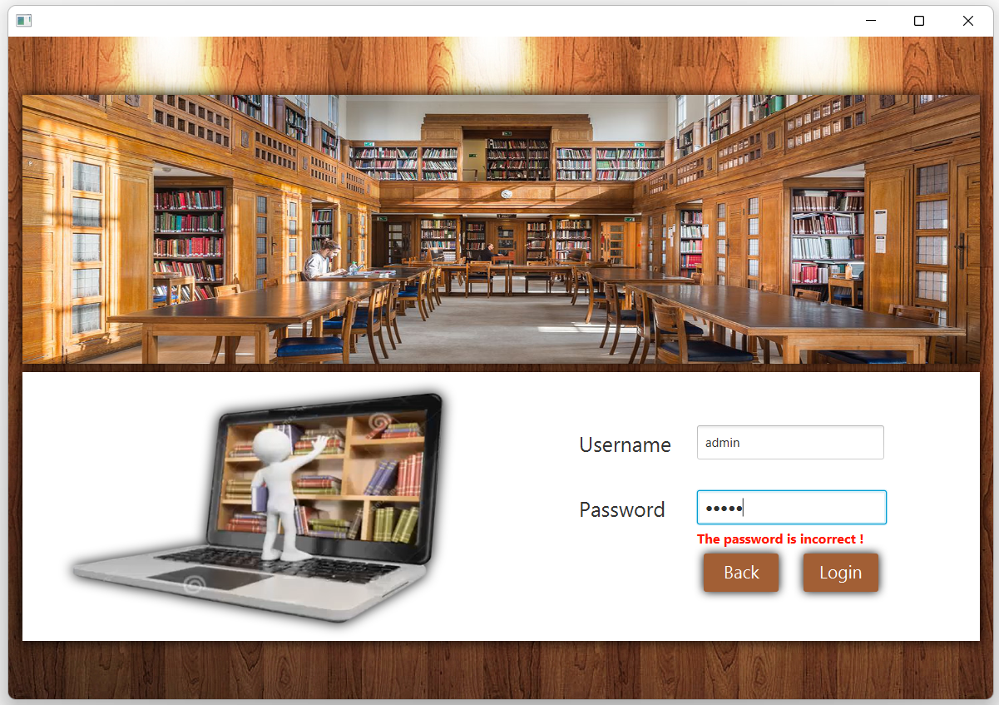</br>

- ***Reserve Book Page :*** &nbsp;The book reservation scenario is applied when there is currently no copy of the book that the customer wants in the library. Therefore, he reserves the first copy that is returned to the library. To start the booking process, we must first `Check Whether We Have An Account For This Customer` or not, and we check this by entering the phone number

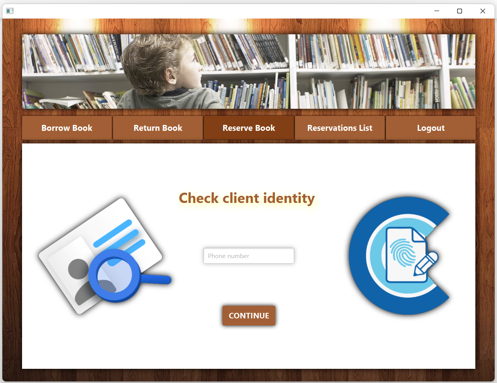</br>

***Note :*** &nbsp;If the `Phone Number Does Not Exist` in the database, you will be automatically redirected to the add customer page

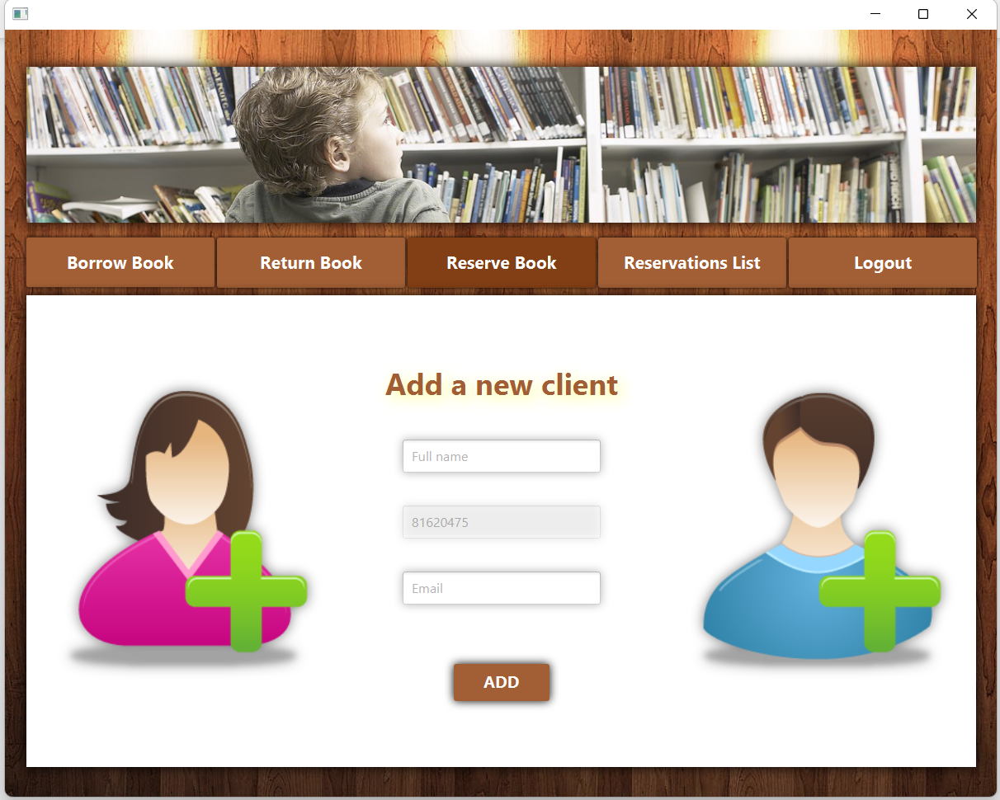</br>

***Note :*** &nbsp;After making sure that our client has an account in the database, we can `Reserve The Book` for him and the date he must come to receive the book will be automatically calculated and shown on the screen

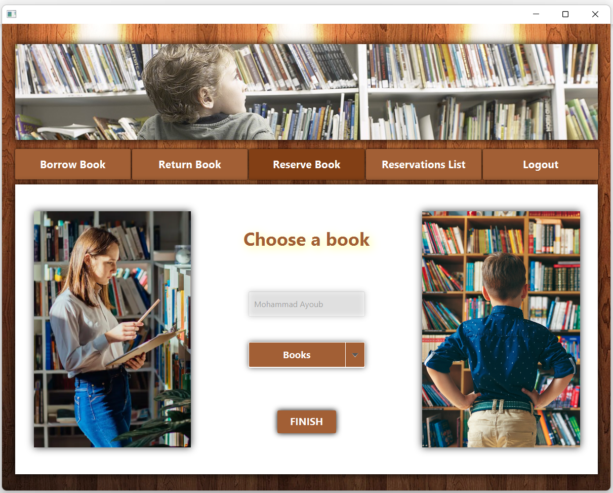</br>

- ***Add Category Page :*** &nbsp;You can create a category with the `Name You Want`, provided it is not already in the database, otherwise you will receive an error message

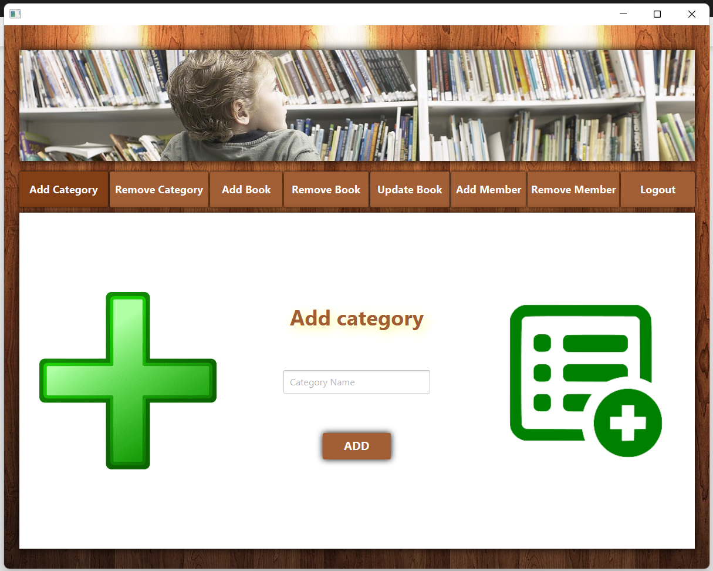</br>

- ***Remove Category Page :*** &nbsp;When a category is removed, `All Related Books` will also be removed and all borrowed and reserved information will disappear

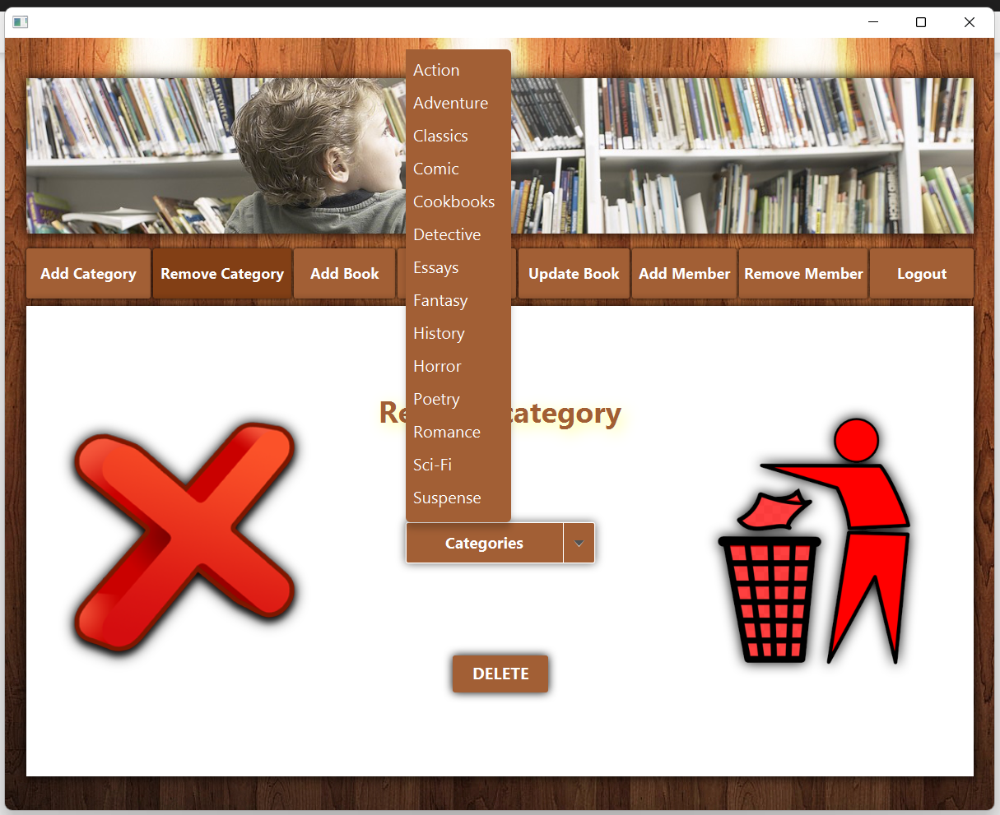</br>

- ***Add Member Page :*** &nbsp;You must `Fill In All Fields` in order to successfully add a new member (with the option to create as admin)

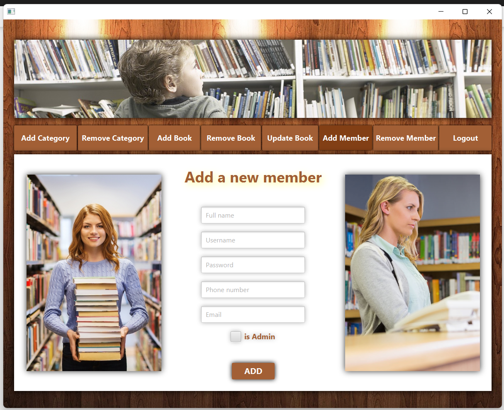</br>

- ***Remove Member Page :*** &nbsp;As an admin, you can `Remove Any Member` whenever you want, and the information related to that member will be gone

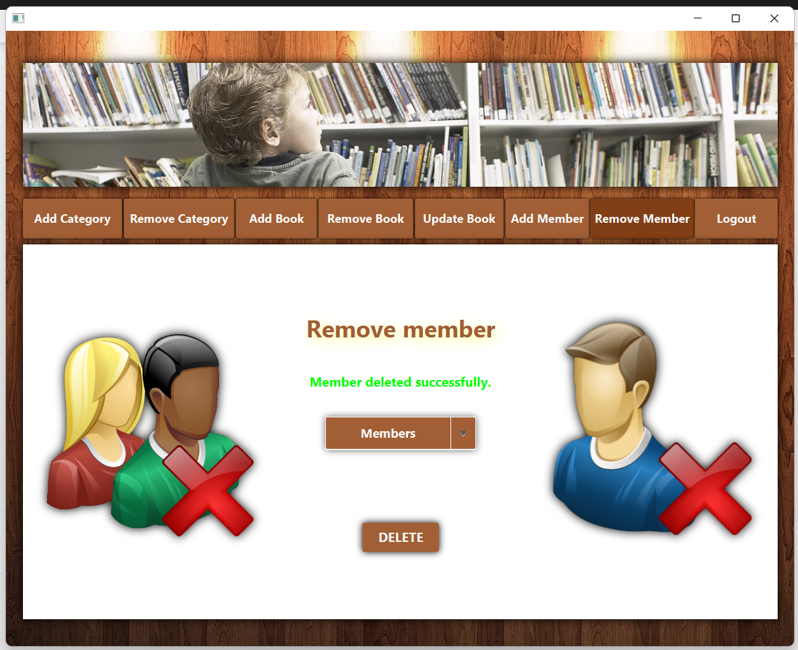</br>

### ***Note :*** &nbsp;The app has more features for the member account, like borrowing a book and returning it or checking the reservation list, and for the admin account, like adding, deleting and updating books, but they are easy to use and that's why I won't show them

<p align="right">(<a href="#readme-top">back to top</a>)</p>


<p align="right">(<a href="#readme-top">back to top</a>)</p>

## Instructions

- Fork this repository
- Clone your forked repository
- Add your scripts
- Commit and push
- Create a pull request
- Star this repository
- Wait for pull request to merge
- Celebrate your first step into the open source world and contribute more

<p align="right">(<a href="#readme-top">back to top</a>)</p>


<p align="right">(<a href="#readme-top">back to top</a>)</p>

## Contact Us

- LinkedIn:  
     [Bayan Cherry](https://www.linkedin.com/in/bayan-cherry-62887a222/)<br/>     [Mohamad Ayoub](https://www.linkedin.com/in/mouhammad-ayoub/)<br/>
    [Alaa Ballout](https://www.linkedin.com/in/alaa-ballout/) <br/>

- Project Link : &nbsp;[https://github.com/alaaballoutdev/Library-Management-System](https://github.com/alaaballoutdev/Library-Management-System)

<p align="right">(<a href="#readme-top">back to top</a>)</p>

## Additional tools to help you get Started with Open-Source Contribution

* [How to Contribute to Open Source Projects – A Beginner's Guide](https://www.freecodecamp.org/news/how-to-contribute-to-open-source-projects-beginners-guide/)
* [How to Write a Good README File for Your GitHub Project](https://www.freecodecamp.org/news/how-to-write-a-good-readme-file/)


<p align="right">(<a href="#readme-top">back to top</a>)</p>

-----------
